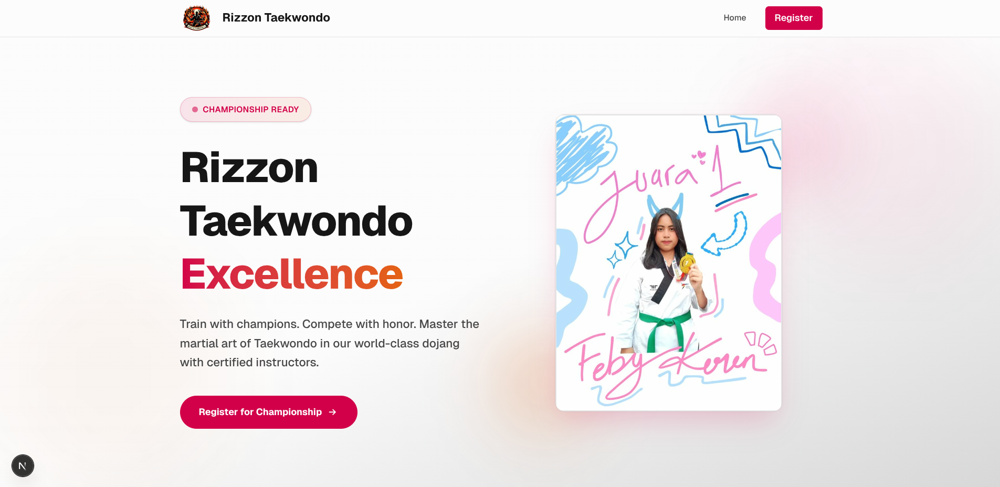
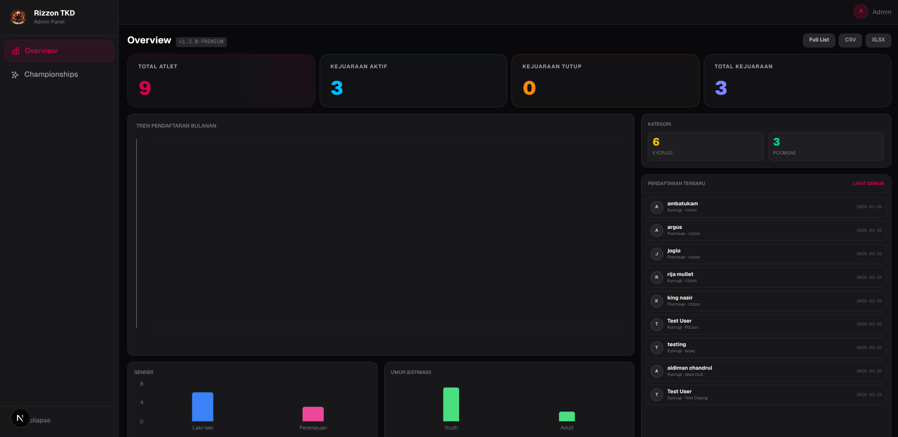
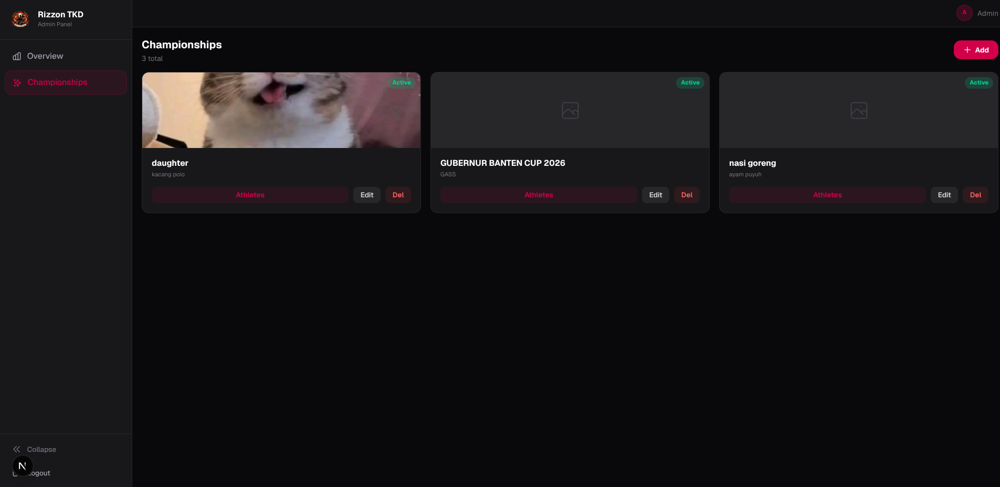
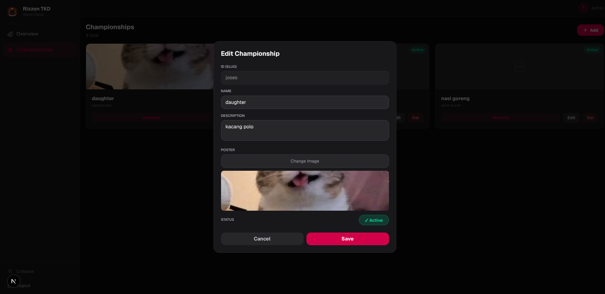
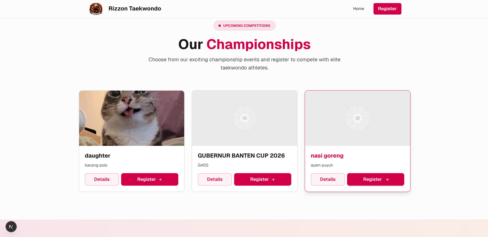
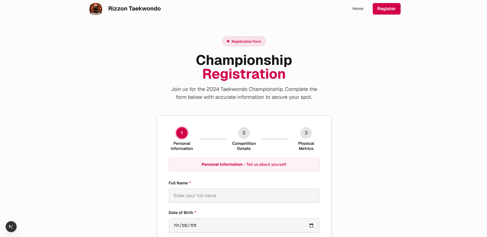

# 🥋 Rizzon Taekwondo Championship Platform



A modern, high-performance web platform designed to streamline Taekwondo championship registrations and provide a comprehensive administrative dashboard for the Rizzon Taekwondo organizing committee.

This platform bridges the gap between a seamless public registration experience and a powerful, data-driven back-office management system.

---

## ✨ Key Features

### 🏆 Public Interfaces
* **Interactive Championship Catalog:** Browse active, upcoming, and past Taekwondo championships with dynamic poster displays.
* **Streamlined Registration Flow:** A frictionless, multi-step form for athletes to register, capturing essential data (name, dojang, category, class, height, weight).
* **Responsive Design:** Fully optimized for mobile and desktop viewing, ensuring accessibility for all participants.

### 🛡️ Secure Admin Dashboard
* **JWT Authentication:** A secure, password-protected entry point (`/rz-x9k7m`) with HTTP-only cookie session management.
* **Real-time Statistics Overview:** Glassmorphism-style UI cards providing instant insights into registration counts, gender distribution, and category breakdowns.
* **Championship Management:** Create, edit, toggle visibility, and delete championships dynamically.
* **Athlete Database Management:** View, search, filter, edit, and safely migrate athletes between different championships.
* **Data Export:** One-click export functionality to generate **CSV** and **XLSX** reports directly from the dashboard.

---

## 📸 Gallery & Interface Previews

### Admin Dashboard Overview
Our premium, glassmorphism dashboard provides a bird's-eye view of all incoming registrations and active events.


### Championship Management
Manage active tournaments, view registered athletes per event, and toggle registration status effortlessly.



### Public Championship List & Registration Form
The public-facing UI where athletes can view upcoming events and submit their registration forms.



---

## 🏗️ Architecture & Technology Stack

This project leverages a modern "Serverless Frontend + Spreadsheet Backend" architecture, maximizing performance while maintaining zero infrastructure costs.

* **Framework:** [Next.js 15](https://nextjs.org/) (App Router, React 19)
* **Styling:** [Tailwind CSS v4](https://tailwindcss.com/) with custom glassmorphism utilities
* **Icons:** [Lucide React](https://lucide.dev/)
* **Charts:** [Recharts](https://recharts.org/) for dynamic data visualization
* **Authentication:** `jose` for robust JWT signing and verification
* **Backend / Database:** Google Sheets API via **Google Apps Script**

### 🧠 The "Spreadsheet as a Database" Concept
To eliminate database hosting costs and provide stakeholders with an interface they already understand (Excel/Sheets), this project uses a highly optimized **Google Apps Script (GAS)** backend.

1. **The Bridge (`Kode.gs`):** A custom Google Apps Script acts as a REST API. It handles `GET` and `POST` requests from the Next.js frontend.
2. **Data Separation:** 
   * The `Ingfo` sheet stores metadata about the Championships (Name, Date, Status, Poster ID).
   * The `Daftar` sheet acts as a relational table, storing all athlete registrations linked by a `competitionId`.
3. **Optimized Fetching:** The backend script reads data in bulk and performs server-side filtering and pagination before sending JSON to the frontend, ensuring the Next.js app remains lightning fast even with thousands of rows.

> **Security Note:** All sensitive endpoints, spreadsheet IDs, and JWT secrets are strictly managed via environment variables (`.env.local`) and are never exposed to the client bundle.

---

## 🚀 Getting Started

### Prerequisites
* Node.js 18+ 
* A Google Account (to host the Google Sheet & Apps Script)

### Installation

1. **Clone the repository**
   ```bash
   git clone https://github.com/qinleeyan/Kejuaraan.git
   cd Kejuaraan
   ```

2. **Install dependencies**
   ```bash
   npm install
   ```

3. **Configure Environment Variables**
   Create a `.env.local` file in the root directory:
   ```env
   # Admin Credentials
   ADMIN_USER=your_admin_username
   ADMIN_PASS=your_secure_password
   JWT_SECRET=your_super_secret_jwt_key_min_32_chars

   # Google Apps Script API Endpoint
   NEXT_PUBLIC_SCRIPT_URL=https://script.google.com/macros/s/.../exec
   ```

4. **Run the Development Server**
   ```bash
   npm run dev
   ```
   Open [http://localhost:3000](http://localhost:3000) to view the application.

---

## 🔐 Deployment & Security Posture

* **Frontend Hosting:** Designed to be easily deployed on [Vercel](https://vercel.com/) or any Node.js compatible hosting.
* **Drive Proxy Routing:** Implements a custom `getDriveImageSrc` URL rewriter to safely bypass Google Drive's third-party `uc?id=` iframe blocking restrictions, ensuring 100% reliable image delivery for championship posters.
* **Middleware Protection:** All `/rz-x9k7m/dashboard/*` routes are intercepted and validated by Next.js edge middleware. Unauthorized requests are instantly redirected to the decoy 404/Login portal.

---
*Designed & Developed with ❤️ for Rizzon Taekwondo.*
